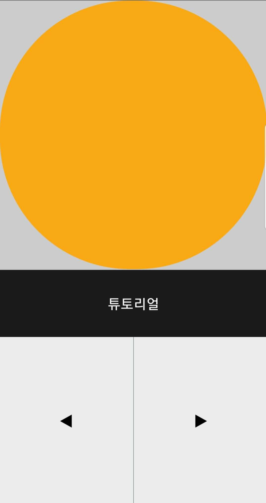
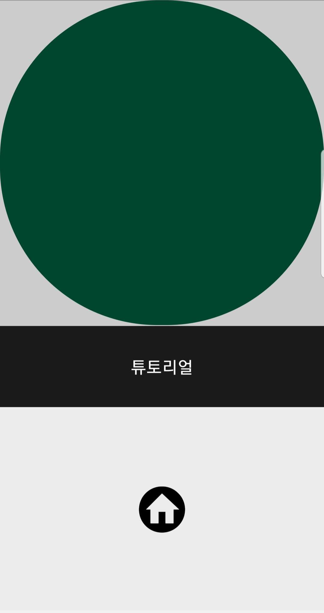
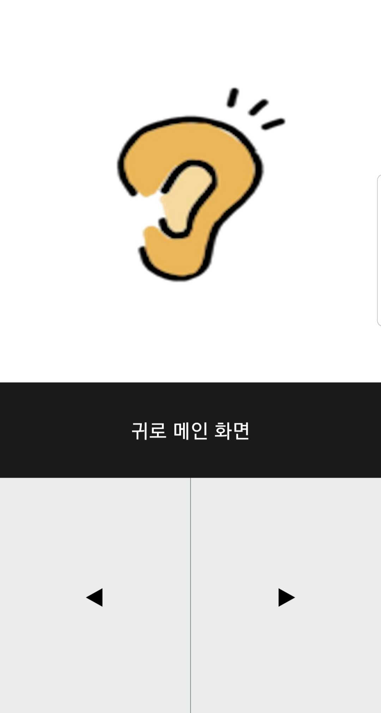
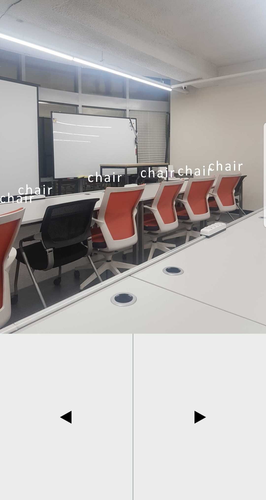
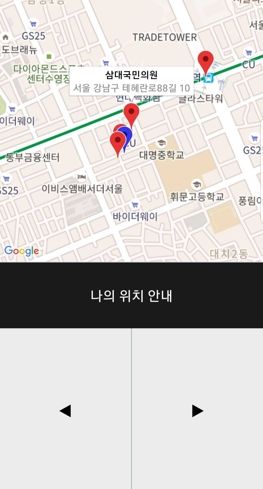

## Introduction

귀로(seeing with your ears)는 음성으로 나의 위치 주변 정보와 시야 정보를 들을 수 있는 안드로이드용 모바일 어플리케이션입니다.


## Preview

- 동영상 주소: https://youtu.be/vNFotiRQKxU (음성 확인을 원하신다면 동영상 시청을 권장합니다.)

- Screen shot

    

  


## Requirements

- 안드로이드 모바일 기기


## **Features**

- 버튼 위치 음성 안내 및 실습 튜토리얼

- 나의 현재 위치 및 가장 가까운 편의시설 음성 안내(지하철역, 병원, 약국, 편의점)

- 나의 시야 사진 객체 분석 및 음성 안내(가까운 사물 / 먼 사물)


## Prerequisites

귀로(seeing with your ears)는 expo 기반의 어플리케이션으로 다음 과정이 선행되어야 합니다.

- desktop에서 expo-cli를 설치합니다. 

```
npm install -g expo-cli
```

- 안드로이드 모바일 기기에서 [Google play store](https://play.google.com/store/apps/details?id=host.exp.exponent) 의 expo 앱을 설치합니다.

- [공공 인공지능 오픈 API/DATA 서비스](http://aiopen.etri.re.kr/service_prepare.php) 에서 해당 페이지 안내에 따라 object-detection-api-key를 발급받습니다.

- [KakaoDevelopers](https://developers.kakao.com/apps) 에서 '내 애플리케이션'을 생성하여 REST API 관련 kakao-api-key를 발급받습니다.

- ` environment.js` 파일을 생성하여 아래 코드를 복사하여 붙여넣은 후 <kakao-api-key> 와 <object-detection-access-key>에 위에서 발급받은 api key를 각각 입력합니다.

```javascript
import  Constants  from 'expo-constants';

const ENV = {
 dev: {
   kakaoApiKey: <kakao-api-key>,
   aiDataApiKey: <object-detection-access-key>
 },
 staging: {
   kakaoApiKey: <kakao-api-key>,
   aiDataApiKey: <object-detection-access-key>
 },
 prod: {
   kakaoApiKey: <kakao-api-key>,
   aiDataApiKey: <object-detection-access-key>
 }
};

const getEnvVars = (env = Constants.manifest.releaseChannel) => {
 if (__DEV__) {
   return ENV.dev;
 } else if (env === 'staging') {
   return ENV.staging;
 } else if (env === 'prod') {
   return ENV.prod;
 }
};

export default getEnvVars;

```


## **Installation**

```
git clone https://github.com/kangsally/seeing-with-your-ears
cd client
# prerequisites의 environment.js파일을 root directory에 추가
npm install
npm start
# 모바일 expo 앱을 실행하여 QR코드 scan
```


## **Skills**

- ES2015+

- React Native

- React Navigation

- Expo

- Expo-speech

- Expo-2d-context

- Obeject Detection API


## **Test**

-  Jest와 Enzyme을 이용한 Component 단위 테스트 구현


## **Other tools**

- Git을 이용한 project 관리

- Trello를 이용한 task 세분화 및 스케줄 관리

- Balsamiq Mockups 3를 이용한 Mockup design


## **Challenges**

- Mobile 어플리케이션, 카메라 및 스피커 사용, 사진 데이터 외부 api 전송 등 처음 접근해보는 것들이 믾아서 익숙해지는 데 시간이 걸렸지만, 배운 것이 많았던 프로젝트였습니다.

- 주요 사용자가 시각장애인이기 때문에 에러가 발생한 경우에도 음성안내가 되면서 간단한 인터페이스로 복구될 수 있도록 에러페이지를 작성했습니다.

- 외부 api의 객체 인식 데이터를 기반으로 사진을 사용자에게 묘사하는 방법에 대해 많은 고민을 했고, 가까운 사물과 먼 사물을 객체 위치에 따라 표현했습니다.


## **Things to do**

- 버그 수정: 나의 시야 촬영화면에서 두번 이상 촬영시 canvas 상에 텍스트 깨짐 현상이 있습니다. Expo-2d-context에서 Component가 re-rendering이 되더라도 context가 clear되지 않는 것 같습니다. (해당 오류는 다른 사용자에게도 나타남을 확인했습니다.) 이 부분은 Expo를 eject하고 react-native의 다른 canvas 라이브러리로 해결하고자 합니다.

- 나의 위치 안내 화면에서 Speach To Text 기능으로 사용자가 음성으로 원하는 편의시설만 안내 받을 수 있는 기능 추가

- 유닛 테스트 추가
- Google play store 배포 
